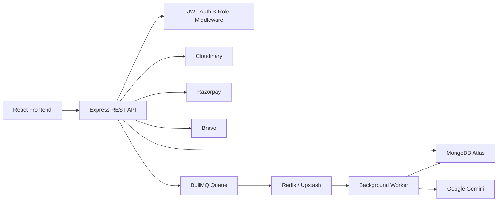

# MindStrata

> An AI-powered learning platform for discovering, purchasing, creating, and learning from courses.

MindStrata is a full-stack online learning platform with separate React and Node.js applications. It supports student and instructor workflows, course creation and publishing, video-based learning, progress tracking, Razorpay payments, transactional email, and asynchronous AI-generated lecture summaries and tests.

---

## ✨ Features

### Students

* Browse and explore courses
* View course details and curriculum
* Purchase courses through Razorpay
* Access enrolled courses and lectures
* Watch lecture videos
* Track completed lectures
* View AI-generated lecture summaries and tests
* Manage profile and account settings
* Contact support

### Instructors

* Create and edit courses
* Upload course thumbnails and lecture videos
* Organize courses into sections and subsections
* Save courses as drafts or publish them
* Manage course content from the dashboard

### Platform

* JWT-based authentication with access and refresh tokens
* Role-based access for Students, Instructors, and Admins
* Cloudinary-based media storage
* Asynchronous lecture processing with BullMQ and Redis
* Gemini-powered lecture summaries and MCQs
* Razorpay payment verification on the server
* Transactional emails through Brevo

---

## 🏗️ Architecture



The frontend communicates with the backend through the `/api/v1` REST API.

Long-running lecture processing is handled asynchronously through BullMQ and Redis using a dedicated background worker.

---

## 🧰 Tech Stack

### Frontend

| Technology         | Purpose                       |
| ------------------ | ----------------------------- |
| React 19           | UI                            |
| Vite 8             | Development and build tooling |
| React Router DOM 7 | Routing                       |
| Redux Toolkit      | Global state management       |
| Tailwind CSS 4     | Styling                       |
| Axios              | API communication             |
| React Hook Form    | Form handling                 |
| Razorpay SDK       | Payment checkout              |
| React Hot Toast    | Notifications                 |

### Backend

| Technology         | Purpose                                  |
| ------------------ | ---------------------------------------- |
| Node.js            | Runtime                                  |
| Express 5          | REST API and middleware                  |
| MongoDB + Mongoose | Database and data modeling               |
| JWT + Bcrypt       | Authentication and password security     |
| Redis + BullMQ     | Background job processing                |
| Google Gemini      | Lecture summarization and MCQ generation |
| Cloudinary         | Image and video storage                  |
| Razorpay           | Payments                                 |
| Brevo              | Transactional email                      |
| express-fileupload | Multipart file handling                  |

---

## 📁 Repository Structure

```text
MindStrata/
│
├── frontend/                    # React frontend application
│   ├── public/                  # Public static files
│   │   ├── favicon.png          # Browser tab favicon
│   │   ├── og-image.png         # Open Graph/social sharing image
│   │   ├── robots.txt           # Search-engine crawler instructions
│   │   └── sitemap.xml          # Search-engine sitemap
│   │
│   ├── src/
│   │   ├── assets/              # Images, icons and other assets
│   │   ├── components/          # Reusable UI components
│   │   ├── data/                # Static application data
│   │   ├── pages/               # Route-level pages
│   │   ├── redux/               # Redux store and slices
│   │   ├── routes/              # Route guards and wrappers
│   │   ├── services/            # API and payment services
│   │   ├── App.jsx              # Route configuration
│   │   ├── index.css            # Global stylesheet
│   │   └── main.jsx             # Frontend entry point
│   │
│   └── package.json
│
├── Server/                      # Node.js / Express backend
│   ├── config/                  # Database and service configuration
│   ├── controllers/             # Business logic
│   ├── middlewares/             # Authentication and authorization
│   ├── models/                  # Mongoose schemas
│   ├── queue/                   # BullMQ configuration
│   ├── routes/                  # API route definitions
│   ├── templates/               # Transactional email templates
│   ├── utilis/                  # Utility and integration functions
│   ├── workers/                 # Background processing workers
│   ├── index.js                 # API server entry point
│   ├── worker.js                # Worker entry point
│   └── package.json
│
└── README.md
```

### Public Assets

The `frontend/public/` directory contains static files served directly by the frontend:

* `favicon.png` — Browser tab favicon.
* `og-image.png` — Open Graph image used when pages are shared.
* `robots.txt` — Provides crawler instructions for search engines.
* `sitemap.xml` — Helps search engines discover public pages.

---

## 🚀 Getting Started

### Prerequisites

* Node.js 18+
* npm 9+
* MongoDB
* Redis
* Accounts/credentials for the external services used by the application

### 1. Clone the repository

```bash
git clone <repository-url>
cd MindStrata
```

### 2. Start the backend

```bash
cd Server
npm install
```

Create `Server/.env` with the required backend configuration.

Start the development server:

```bash
npm run dev
```

The backend runs on port `4000` by default.

### 3. Start the background worker

Redis must be available for asynchronous lecture processing.

Open another terminal:

```bash
cd Server
npm run worker
```

### 4. Start the frontend

```bash
cd frontend
npm install
npm run dev
```

The frontend runs on:

```text
http://localhost:5173
```

### 5. Production build

```bash
cd frontend
npm run build
```

---

## 🔐 Environment Variables

Do not commit `.env` files or real credentials.

### Frontend

Create `frontend/.env`:

```env
VITE_BACKEND_URL=http://localhost:4000/api/v1
VITE_RAZORPAY_KEY_ID=your_razorpay_key_id
```

### Backend

Create `Server/.env`:

```env
PORT=4000
MONGODB_URL=your_mongodb_connection_string

JWT_SECRET=your_access_token_secret
REFRESH_SECRET=your_refresh_token_secret

FRONTEND_URL=http://localhost:5173

CLOUD_NAME=your_cloudinary_cloud_name
API_KEY=your_cloudinary_api_key
API_SECRET=your_cloudinary_api_secret
FOLDER_NAME=MindStrata

RAZORPAY_KEY_ID=your_razorpay_key_id
RAZORPAY_KEY_SECRET=your_razorpay_key_secret

GEMINI_API_KEY=your_gemini_api_key

REDIS_HOST=your_redis_host
REDIS_PORT=6379
REDIS_USERNAME=your_redis_username
REDIS_PASSWORD=your_redis_password
REDIS_TLS=true

BREVO_API_KEY=your_brevo_api_key
MAIL_USER=your_verified_sender_email
MAIL_NAME=MindStrata Support
```

---

## 🔑 Authentication

MindStrata uses short-lived access tokens and long-lived refresh tokens.

```text
Login / Signup
      ↓
Access Token + Refresh Token
      ↓
Access Token → Authorization: Bearer <token>
Refresh Token → HTTP-only cookie
      ↓
Protected API Route
      ↓
JWT Verification
      ↓
Role Check (when required)
      ↓
Controller
```

* Access tokens expire after 20 minutes.
* Refresh tokens expire after 15 days.
* Protected API requests use the `Authorization` header.
* Refresh tokens are stored in an HTTP-only cookie.
* Frontend Axios interceptors handle expired access tokens and attempt token refresh.
* Supported backend roles are `Student`, `Instructor`, and `Admin`.

---

## 💳 Payment Flow

Course purchases use Razorpay with server-side signature verification.

```text
Student selects course
        ↓
Frontend requests payment order
        ↓
Backend creates Razorpay order
        ↓
Razorpay Checkout
        ↓
Payment completed
        ↓
Frontend sends payment identifiers
        ↓
Backend verifies Razorpay signature
        ↓
Student is enrolled in course
```

The backend verifies the payment signature before updating enrollment records.

---

## 🤖 AI Lecture Processing

Lecture processing is asynchronous so video uploads do not require the API request to wait for AI generation.

```text
Instructor uploads lecture
        ↓
Cloudinary stores video
        ↓
SubSection created
        ↓
AI job added to BullMQ
        ↓
Redis
        ↓
Background Worker
        ↓
Gemini processes lecture
        ↓
Summary + MCQs generated
        ↓
MongoDB updated
```

Lecture processing uses statuses such as:

```text
PENDING → PROCESSING → COMPLETED
                     ↘ FAILED
```

---

## 🌐 API

All backend endpoints use the `/api/v1` prefix.

### Main API Groups

| Group          | Prefix            | Purpose                                             |
| -------------- | ----------------- | --------------------------------------------------- |
| Authentication | `/auth`           | Signup, login, OTP, password and session management |
| Profile        | `/profile`        | Profile and account operations                      |
| Courses        | `/course`         | Courses, sections, subsections and categories       |
| Progress       | `/courseProgress` | Student lecture progress                            |
| Summary        | `/summary`        | AI lecture summary/test generation                  |
| Payments       | `/payment`        | Razorpay order creation and verification            |
| Contact        | `/contactUs`      | Support inquiries                                   |

For complete endpoint details, request fields, and middleware configurations, see the corresponding router files in the [Server/routes/](Server/routes/) directory.

---

## 🗺️ Frontend Routes

| Route                                                  | Access     | Purpose                   |
| ------------------------------------------------------ | ---------- | ------------------------- |
| `/`                                                    | Public     | Landing page              |
| `/login`                                               | Public     | Login                     |
| `/signup`                                              | Public     | Registration              |
| `/contactUs`                                           | Public     | Contact support           |
| `/resetpassword`                                       | Public     | Password recovery         |
| `/courses`                                             | Public     | Browse courses            |
| `/courseDetails/:courseID`                             | Public     | Course details            |
| `/changePassword`                                      | Protected  | Change password           |
| `/dashboard`                                           | Protected  | User dashboard            |
| `/dashboard/profile`                                   | Protected  | Profile                   |
| `/dashboard/settings`                                  | Protected  | Account settings          |
| `/dashboard/addCourse`                                 | Instructor | Create course             |
| `/dashboard/editCourse/:courseID`                      | Instructor | Edit course               |
| `/dashboard/my-courses`                                | Instructor | Instructor courses        |
| `/dashboard/enrolledCourses`                           | Student    | Purchased courses         |
| `/dashboard/cart`                                      | Student    | Cart and checkout         |
| `/learnCourse/:courseID`                               | Protected  | Course learning interface |
| `/learnCourse/:courseID/section/:sectionID/subsection/:subSectionID` | Protected  | Lecture player            |

---

## 🗄️ Core Data Model

```text
User
 ├── Profile
 ├── Courses
 └── CourseProgress

Course
 ├── Instructor → User
 ├── Category
 ├── Sections
 ├── Students Enrolled
 └── Ratings & Reviews

Section
 └── SubSections
      ├── Video
      ├── Summary
      └── MCQs

CourseProgress
 ├── User
 ├── Course
 └── Completed Lectures
```

---

## 🛠️ Development

### Frontend

Key frontend areas:

* `src/main.jsx` — application entry point, Redux and Router providers
* `src/App.jsx` — route definitions and layouts
* `src/components/` — reusable feature components
* `src/pages/` — route-level pages
* `src/redux/` — Redux store and slices
* `src/routes/` — route protection
* `src/services/` — API and payment services
* `public/` — static assets, SEO files and social sharing assets

### Backend

Key backend areas:

* `routes/` — endpoint definitions
* `controllers/` — business logic
* `models/` — MongoDB schemas
* `middlewares/` — authentication and role authorization
* `queue/` — BullMQ configuration
* `workers/` — background lecture processing
* `utilis/` — utility and external-service functions
* `config/` — database and service configuration

---


## 🔒 Security

* Never commit `.env` files or API credentials.
* Keep JWT, refresh-token, database, Redis, Cloudinary, Gemini, Razorpay and Brevo secrets private.
* Only the Razorpay public key is exposed to the frontend.
* Payment signatures are verified by the backend before enrollment.
* Refresh tokens use HTTP-only cookies.
* Protected endpoints use JWT and role-based middleware.


---

## Author

**Parv Goyal**